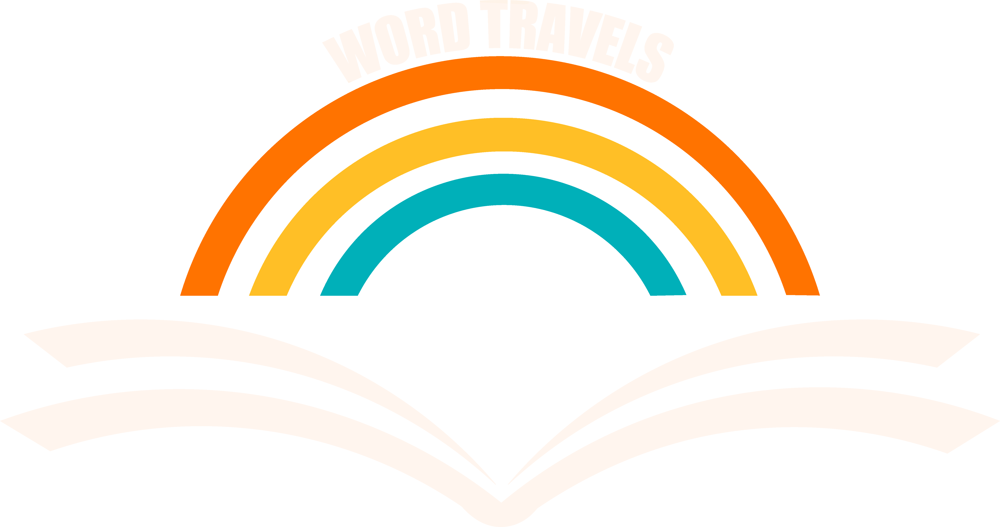
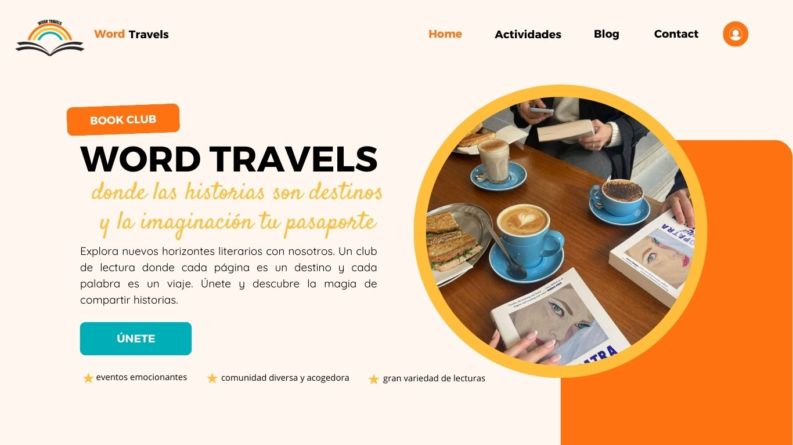

# DIU - Practica 3, entregables

## Moodboard (diseño visual + logotipo)   

Nuestro propósito es fomentar el amor por la lectura en todas las edades, creando un espacio seguro y acogedor para compartir ideas y discutirlas.

Hemos utilizado una tipografía redondeada y suave que transmite una sensación amigable y en la paleta de colores el color naranja como representante de un lugar para todas las edades(Familia), el color amarillo representa la creatividad e innovación de algo nuevo y el color azul para la tranquilidad y el sentimiento de lugar seguro que queremos crear.

Por último un eslogan que evoca la idea de que la lectura puede transportarte a diferentes lugares: "Donde las historias son destinos y la imaginación tu pasaporte", y un logo intuitivo, que identifique de manera distintiva un club de lectura:

[Moodboard en Figma](https://www.figma.com/board/SIh3780BdQPGqi1AGTJdJa/Moodboard?t=PgSfEHM37ntM5BIR-6)

## Landing Page

Creado con Canvas

## Guidelines

La  información y la implementación sobre los patrones de diseño se ha extraído de [Google Material design](https://m3.material.io/).

- Botones:
	+ Situados en el header:
		+ Home: Cuya funcionalidad es retornar a la página principal.
		+ Actividades: Al activar el botón, genera un menú desplegable que te permite acceder a la página de Calendario, Eventos y Programación.
		+ Blog: Usado para acceder al Blog, abre otro menú desplegable en el que puedes acceder a las Noticias, Artículos y Publicaciones de los usuarios.
		+ Contacto: Accede a una página de contacto para que el usuario escriba todas las dudas y propuestas que considere.
		+ Imagen Registrarse: Al hacer click, el usuario podrá iniciar sesión y/o registrarse al club de lectura. Para escribir en el blog el usuario deberá de estar registrado.
	+ Situados en el footer:
		+ Menú legal: Muestra información acerca de los términos y condiciones de uso, la protección de datos y la política de cookies.
		+ Secciones: Te ofrece acceso directo a las distintas secciones de la página web (Home, Actividades, Blog).
		+ Redes sociales: Muestra el enlace directo a las distintas redes sociales del club de lectura (Instagram, Facebook, Twitter).
	
- Navegación
	+ Buscador: Para, sin cambiar de página, mostrar contenido que tenga una cierta relacción. Usado en todas las pantallas de la página web

- Contenido
	+ Página principal:
		+ Carrousel: Para mostrar una serie de imágenes o vídeos al usuario en el mismo espacio en el que da información sobre las próximas actividades y las entradas más recientes del club acompañado de una breve descripción.
		
	+ Página actividad:
		+ Carrousel: Para mostrar una serie de imágenes o vídeos al usuario sobre la actividad en cuestión, incluye información a cerca de esta.
		+ Botón APÚNTAME: Registra a un usuario en la actividad que desee.
	
	+ Página calendario:
		+ Calendario: Muestra un calendario con información sobre las próximas reuniones, los próximos eventos y las próximas firmas con autores.
	
	+ Página Blog:
		+ Texto: Contiene todas las entradas al blog que han creado los usuarios registrados en el club de lectura.
		+ Filtrado de entradas: Permite filtrar las entradas del blog.
	
	+ Página login:
		+ Formulario inicio de sesión: junto a dos inputs, uno para el email y otro para contraseña.
		+ Formulario registrarse: junto a tres inputs, uno que registra el nombre de usuario, y los otros dos para el email y la contraseña.

## Mockup: LAYOUT HI-FI

Hemos creado una versión del prototipo (WIREFRAME) adaptada a PC formato WEB

[Layout en Figma](https://www.figma.com/design/tQjeJnUP4xy2wKPeYDdeu5/Layout-HiFi?m=auto&t=PgSfEHM37ntM5BIR-6)

[Layout PDF](LayoutHiFi.pdf)

## Documentación: Publicación del Case Study

[Case Study](https://carmenxufdz.github.io/DIU24/#/)

(incluye) Valoración del equipo sobre la realización de esta práctica o los problemas surgidos

