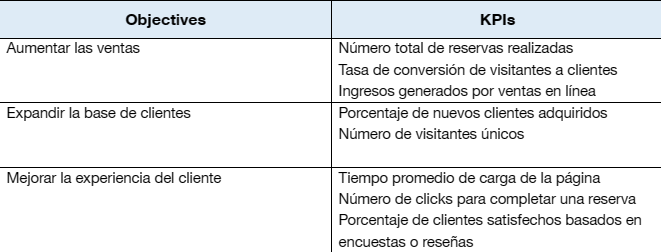
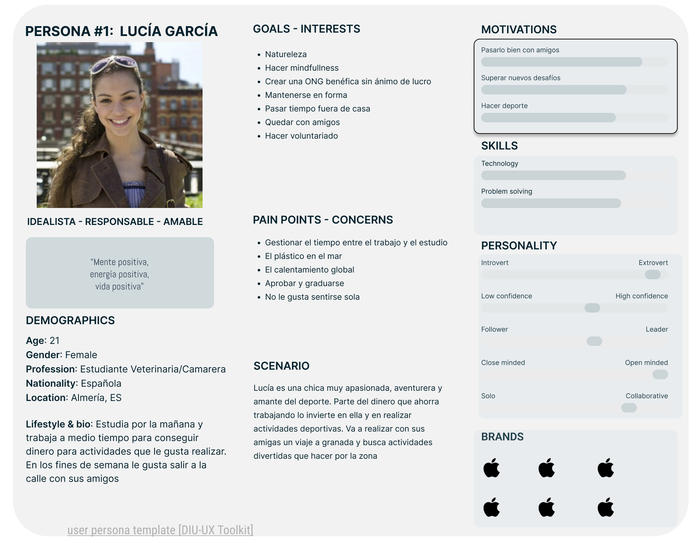
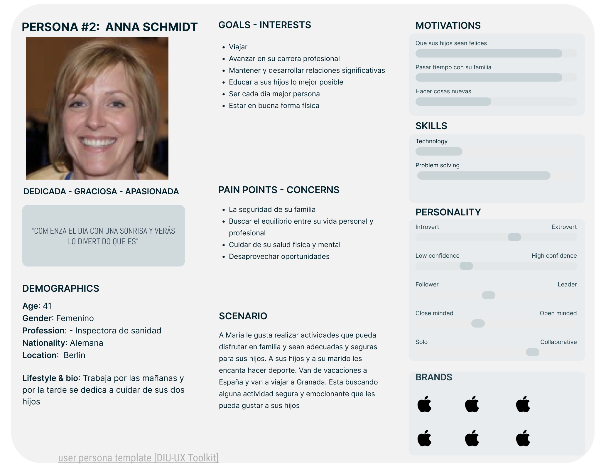
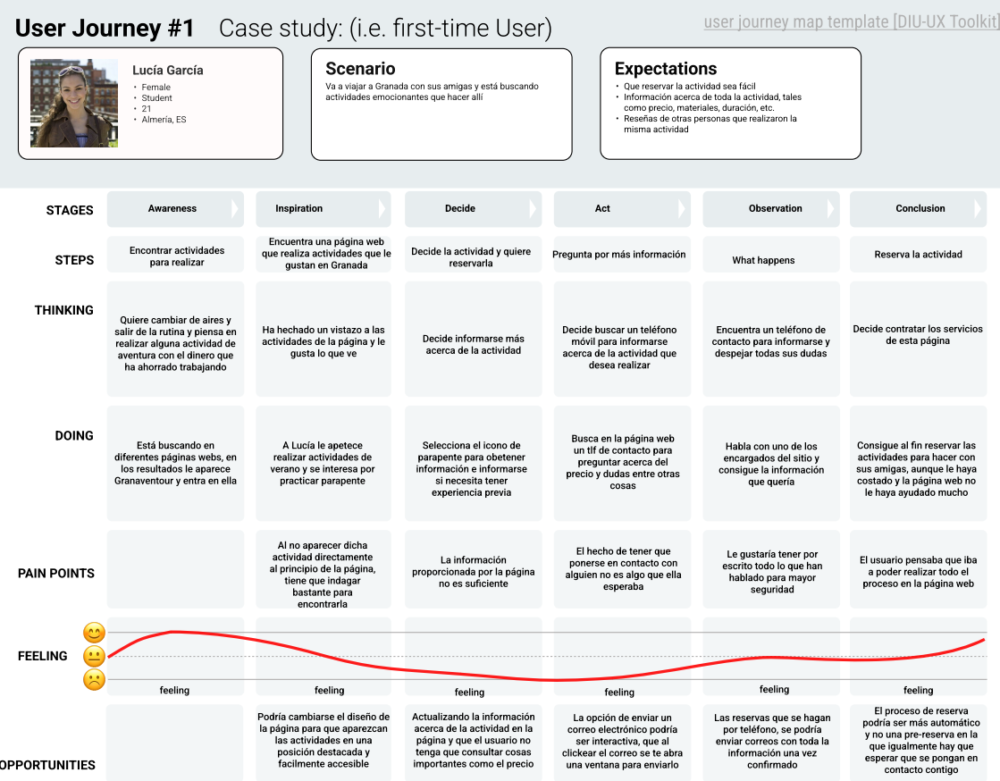
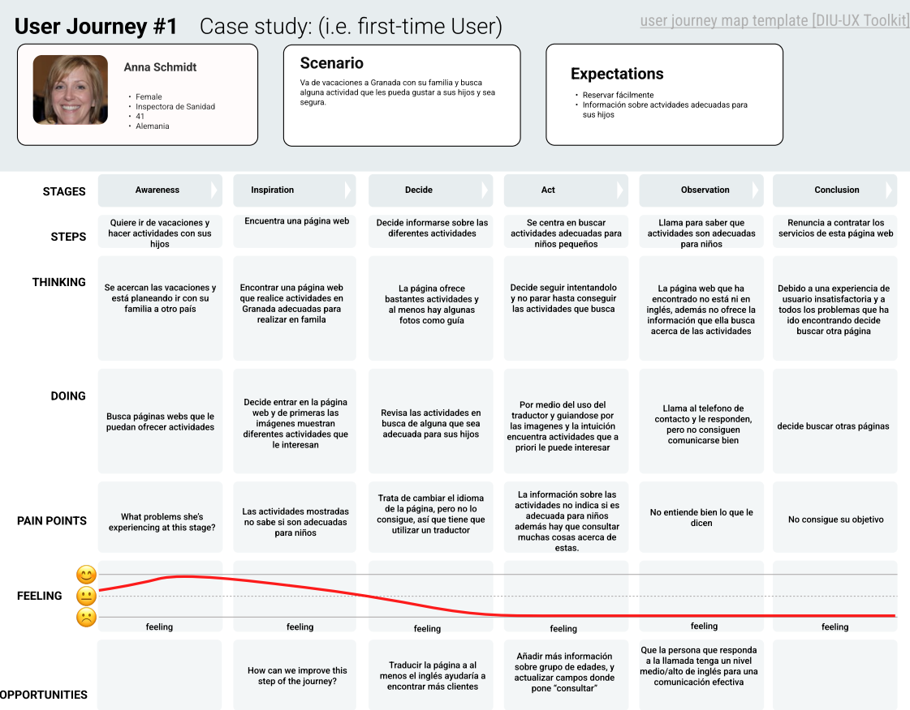
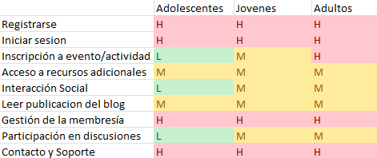
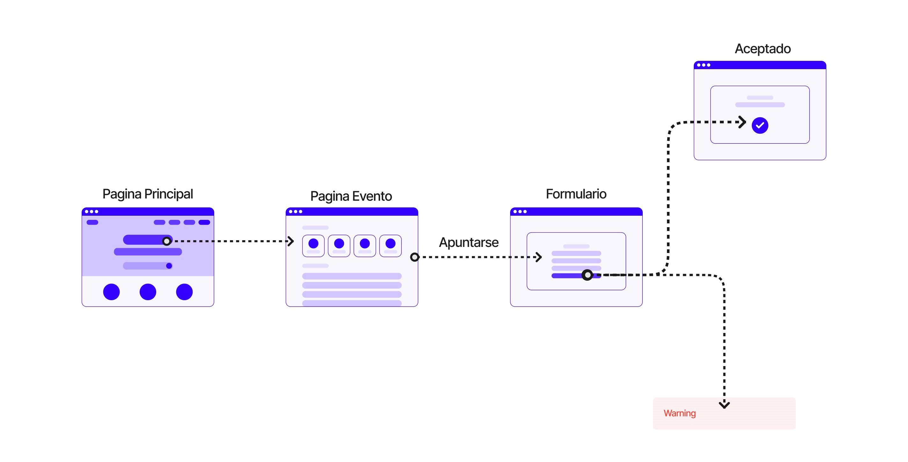
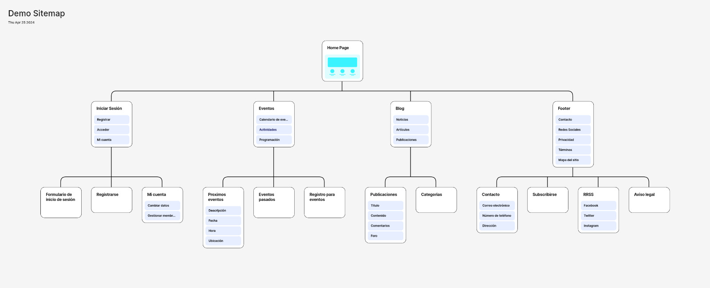
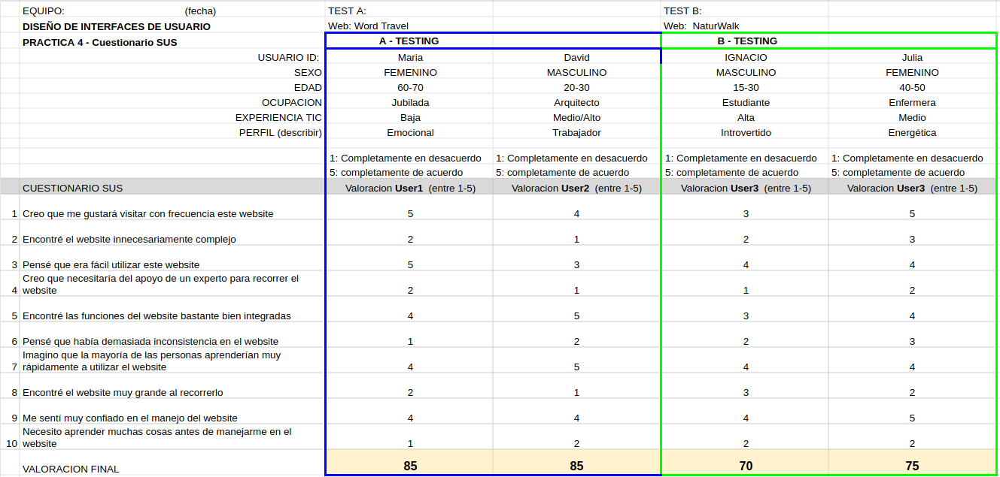
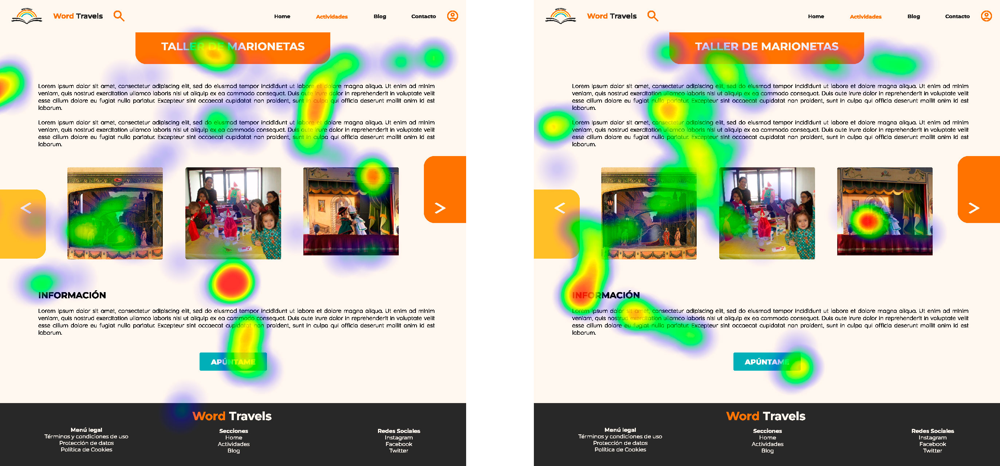

# DIU24
**Prácticas Diseño Interfaces de Usuario 2023-24**. Tema: Club de Lectura 

>**Grupo**: DIU3_FETON'T.  Curso: 2023/24 

>**Proyecto**: Word Travel

>**Descripción**: Pagina web de un club de Lectura

>**Miembros**:
> - :bust_in_silhouette:   Carmen Chunyin Fernández Núñez     :octocat:   www.github.com/carmenxufdz  
> - :bust_in_silhouette:  Jesús Navarrete Caparrós     :octocat: www.github.com/jesus12345678901

----- 

# Proceso de Diseño 

## Paso 1. UX User & Desk Research & Analisis 

###  1.a User Reseach Plan

<h4>What is this project about?</h4>

Este proyecto consiste en el análisis de una página web especializada en actividades al aire libre, cursos, rutas y viajes de aventura. La página se centra en ofrecer una gran variedad de experiencias, que van desde deportes extremos como escalada, barranquismo y esquí hasta actividades de turismo.

<h4>What’s the purpose of this research? </h4>

Este análisis se centrará en evaluar la estructura, contenido, funcionalidades y estrategias de marketing de la página web, con el objetivo de identificar áreas de mejora y oportunidades para mejorar la experiencia del usuario.

<h4>What insights will this research generate? </h4>

Algunos de los insights que generará este análisis son:

<ul>
  <li>Preferencia de los usuarios: Identificar qué actividades son más populares y qué tipos de rutas/viajes generan más interés.</li>
  <li>Usabilidad del Sitio Web: Descubrir cualquier problema de usabilidad que dificulte la navegación o la interacción, además de identificar zonas dónde la estructura de la web pueda ser confusa</li>
  <li>Contenido Relevante: Determinar qué tipo de contenido resulta más útil y relevante y evaluar si la información proporcionada es suficiente y clara para los usuarios</li>
</ul>

-----

<h4>Business Objectives & KPIs</h4>

<h4>Research Success Criteria</h4>

<h5>What qualitative and quantitative information about users will be collected?</h5>
<h6>Información cualitativa:</h6>
<ul>
  <li>Preferencias e intereses en actividades al aire libre</li>
  <li>Experiencias pasadas con este tipo de actividades</li>
  <li>Factores que influyen en las decisiones de reserva y compra</li>
  <li>Expectativas sobre la experiencia del usuario en el sitio web</li>
  <li>Sugerencias para mejorar la navegación, el contenido y las funcionalidades del sitio</li>
</ul>
<h6>Información cuantitativa:</h6>
<ul>
  <li>Número de visitas al sitio web y páginas vistas</li>
  <li>Tasa de conversión de visitantes a clientes</li>
  <li>Tiempo promedio de sesión en el sitio web</li>
  <li>Porcentaje de usuarios que abandonan el sitio en el proceso de reserva</li>
</ul>

<h5>What documents or artifacts need to be created?</h5>
<ul>
  <li>Guía de Entrevistas o Cuestionario de Encuestas: Documento con preguntas específicas que se harán a los usuarios</li>
  <li>Mapa de Experiencia del Usuario: Representa el flujo de interacción del usuario con el sitio web</li>
  <li>Lista de Prioridades de Mejoras: Documento dónde se identifican las áreas a mejorar en el sitio web</li>
  <li>Informe de Seguimiento y Evaluación: Documento que proporciona una evaluación posterior a la implementación de las mejoras.</li>
</ul>

<h5>What decisions need to be made with the research insights?</h5>
<ul>
  <li>Priorización de Mejoras: Decidir qué áreas del sitio web requiere atención prioritaria</li>
  <li>Desarrollo de Nuevas Funcionalidades</li>
  <li>Optimización del contenido</li>
  <li>Diseño y Navegación: Decidir cómo mejorar el diseño visual y la estructura de navegación del sitio web</li>
</ul>

-----

<h4>Primary research</h4>

<ul>
  <li><b>Ethnography  (observation).</b> Observar el contexto de los usuarios para comprender sus comportamientos, actitudes e interacciones. Su propósito es obtener una comprensión de las experiencias y comportamientos de los usuarios en entornos del mundo real</li>
  <li><b>User interview.</b> Conversaciones estructuradas con usuarios para explorar sus necesidades, preferencias y experiencias.</li>
  <li><b>Contextual inquiry.</b> Observar a los usuarios mientras realizan tareas o interactúan con un producto o servicio. Su propósito es comprender cómo trabajan los usuarios e identificar oportunidades de mejora</li>
  <li><b>Usability test.</b> Observar a los usuarios para identificar problemas de usabilidad y recopilar comentarios sobre su facilidad de uso.Su propósito es evaluar la efectividad, eficiencia y satisfacción de la experiencia del usuario.</li>
  <li><b>Post-session survey.</b> Se administran justo después de un Usability test para recopilar comentarios sobre la experiencia general e impresiones. Su propósito es capturar las percepciones de los usuarios e identificar áreas de mejora después de la sesión de prueba.</li>
</ul>

-----

<h4>Question themes</h4>

<b>User Preferences and Needs</b>

<ul>
  <li>¿Qué actividades son las más populares?</li>
  <li>¿Qué tipo de cursos o rutas buscan los usuarios?</li>
  <li>¿Qué factores influyen en las decisiones a la hora de elegir las actividades o las rutas?</li>
</ul>

<h4>Design focus components</h4>

<ul>
  <li>Utility: Is the content or functionality useful to intended users?</li>
  <li>Learnability: How easy is it for users to accomplish basic tasks the first time they encounter the design?</li>
  <li>Efficiency: Once users have learned the design, how quickly can they perform tasks?</li>
  <li>Memorability: When users return to the design after a period of not using it, how easily can they reestablish proficiency?</li>
  <li>Errors: How many errors do users make, how severe are these errors, and how easily can they recover from the errors?</li>
  <li><del>Satisfaction: How pleasant is it to use the design?</del></li>
  <li><del>Persuasiveness: Are desired actions supported and motivated?</del></li>
</ul>

-----

<ul>
  <li><b>Entusiastas de la Naturaleza y Aventura.</b> Estos usuarios disfrutan de las actividades al aire libre, les gusta explorar nuevos lugares y desafiar sus límites físicos. Buscan experiencias emocionantes que le permitan conectar con la naturaleza.</li>
  <li><b>Viajeros Aventureros.</b> Estos usuarios disfrutan de viajes llenos de aventuras y experiencias únicas. Les gusta hacer actividades fuera de lo común y sumergirse en diferentes entornos. Buscan salir de su zona de confort y crear recuerdos duraderos.</li>
  <li><b>Familias Activas.</b> Estos usuarios son familias que disfrutan pasar tiempo juntas al aire libre y participar en actividades recreativas. Buscan opciones de actividades y destinos que sean seguros, divertidos y adecuados para todas las edades.</li>
</ul>

###  1.b Competitive Analysis

Las páginas escogidas para hacer el Competitive Analysis son: Spain.info y Yumping. Ambas son páginas que ofrecen actividades de turismo y deportes en España y otras partes del mundo. Al compartir tantas similitudes nos hemos decantado por estas dos páginas.

Desde que entras en las páginas, se ve una clara diferencia en el diseño. Además de que soportan compatibilidad con otros dispositivos. Implementan varias funciones de las cuales Granaventour carece, como búsqueda por filtros, mapas interactivos, existencia de reseñas, diferentes idiomas… Esta páginas proveen la información necesaria para el usuario sin necesidad de contactar con terceros.
Las dos páginas elegidas nos han gustado bastante por diferentes motivos, Spain.info implementa mapas interactivos para elegir la ciudad donde quieres realizar las actividades, lo cual nos parece una idea original, creativa y llamativa. Por otro lado, Yumping implementa búsqueda con filtros por actividades y lugares, lo cual es una funcionalidad bastante útil.

Si tuviésemos que quedarnos con una, elegiríamos Spain.info pues nos ha gustado la implementación del mapa interactivo, además de que nos parece que el contenido e información mostrada por la página está muyu bien. También la estructura de la página y su diseño es intuitivo y fácil de usar.

En comparación con Granaventour son páginas bastante completas y bien dirigidas al usuario, lo cual sigue afirmando el hecho de que Granaventour tendría muchas cosas que mejorar respecto a su diseño, funcionalidades e información aportada.

###  1.c Persona
-----

<b>Lucía:</b> hemos decidido elegir un perfil parecido al nuestro, en este caso una chica joven que estudia y trabaja al mismo tiempo y desea gastar el dinero que ahorra en actividades que le gustan y le hacen sentir plena y libre.

<b>Anna:</b> ha sido elegida porque cumple el perfil de persona extranjera que está visitando España. Además su familia tiene especial interés en actividades deportivas, entonces es normal asumir que buscaría ese tipo de actividades para realizarlas en sus vacaciones.

####  1.d User Journey Map
----

<b>Lucía:</b> nos hemos puesto en su piel y finalmente ha conseguido realizar la reserva para realizar la actividad de parapente con sus amigas sin muchas complicaciones a pesar de encontrarse con problemas como el tema del precio que no está disponible en la página  o tener que llamar al teléfono de contacto para obtener más información acerca de la actividad.

<b>Anna:</b> finalmente Anna no ha sido capaz de realizar la reserva de las actividades que quería realizar en familia y ha acabado desistiendo debido a la insuficiente información, a la falta de entendimiento y a problemas técnicos por parte de la página web como puede ser el tema del idioma.

###  1.e Usability Review
----
>>> - Enlace al documento:  <a href="P1/Usability Review/Usability-review.xlsx">Usability Review</a>
>>> - Valoración final (numérica): 49

En general es una página accesible por la mayoría de usuarios (hispanohablantes) pero que no cumple requisitos y carece de información necesaria. La estructura y diseño de la página tiene cosas que mejorar, aunque no está del todo mal. Hay funcionalidades básicas que no implementa o las implementa mal. Cumple las funciones a un nivel muy básico y para poder terminar cualquier proceso o obtener más información tendrás que ponerte en contacto con algún trabajador.

## Paso 2. UX Design  

###  2.a Reframing / IDEACION: Feedback Capture Grid / Empathy map 
----

>>> Comenta con un diagrama los aspectos más destacados a modo de conclusion de la práctica anterior,

 Interesante | Críticas     
| ------------- | -------
  Preguntas | Nuevas ideas
  
    
>>> ¿Que planteas como "propuesta de valor" para un nuevo diseño de aplicación para economia colaborativa ?
>>> Problema e hipótesis
>>>  Que planteas como "propuesta de valor" para un nuevo diseño de aplicación para economia colaborativa te
>>> (150-200 caracteres)

En esta práctica presentamos como propuesta de valor un Club de Lectura, el objetivo del club de lectura es fomentar el amor por la lectura en personas de todas las edades a la vez que impulsar el debate y compartir ideas con otros individuos. Pensamos que un club de lectura les puede interesar a nuestras personas, pues la lectura es una actividad que se puede realizar a cualquier edad y al existir muchos géneros y tipos de libros puede alcanzar una gran variedad de público.

<h4>Empathy Map</h4>

###  2.b ScopeCanvas
----

###  2.b User Flow (task) analysis 
-----

>>> Definir "User Map" y "Task Flow" ... 

###  2.c IA: Sitemap + Labelling 
----

>>> Identificar términos para diálogo con usuario  

Término | Significado     
| ------------- | -------
| Iniciar Sesión |Te abre un formulario para Iniciar Sesión
| Registrarse |Te abre un formulario para registrarte 
| Mi Cuenta | Te lleva a la página de tu perfil
| Cambiar Datos | Te lleva a una página donde puedes cambiar tu nombre de usuario, correo o contraseña
| Gestionar Membresía | Te lleva a una página para gestionar la membresía, cancelarla, cambiar el plan
| Calendario Eventos | Te lleva a una página dónde aparece un calendario mensual y en él están apuntados los eventos
| Actividades |Te lleva a una página dónde se muestran las actividades, con su descripción, y puedes inscribirte en ellas
| Programación |Muestra una programación de los próximos eventos
| Noticias | Estar al tanto de lo que pasa tanto en el club como en el mundo literario
| Artículos | Entradas en un blog de los eventos y actividades que realiza el club
| Categorías | Filtrar la búsqueda según el género literario
| Publicaciones | Contiene una lista o índice de las publicaciones acerca de libros en el sitio web
| Foro | Cada página de un blog dedicada a un libro tiene su foro dónde se puede debatir online
| Contacto | Proporciona información sobre cómo los usuarios pueden ponerse en contacto con el sitio web
| Redes Sociales | Enlace directo a las RRSS del club de lectura
| Privacidad | Aborda las políticas, prácticas y medidas relacionadas con la privacidad de los usuarios
| Términos | Sección que detalla los términos y condiciones de uso del sitio web
| Mapa del sitio | Te muestra la ubicación del club

###  2.d Wireframes
-----
> [!NOTE]
> <a href="P2/ResponsivePage.pdf">Responsive Page</a>

<h4>Página Principal</h4>

<h4>Página de Actividad</h4>

<h4>Página de Blog</h4>

## Paso 3. Mi UX-Case Study (diseño)

###  3.a Moodboard
-----

[Moodboard en Figma](https://www.figma.com/board/SIh3780BdQPGqi1AGTJdJa/Moodboard?t=PgSfEHM37ntM5BIR-6)

###   3.b Landing Page
----

Hemos utilizado la herramienta Canvas para realizar el Landing Page

###  3.c Guidelines
----

La  información y la implementación sobre los patrones de diseño se ha extraído de [Google Material design](https://m3.material.io/).

- Botones:
	+ Situados en el header:
		+ Home: Cuya funcionalidad es retornar a la página principal.
		+ Actividades: Al activar el botón, genera un menú desplegable que te permite acceder a la página de Calendario, Eventos y Programación.
		+ Blog: Usado para acceder al Blog, abre otro menú desplegable en el que puedes acceder a las Noticias, Artículos y Publicaciones de los usuarios.
		+ Contacto: Accede a una página de contacto para que el usuario escriba todas las dudas y propuestas que considere.
		+ Imagen Registrarse: Al hacer click, el usuario podrá iniciar sesión y/o registrarse al club de lectura. Para escribir en el blog el usuario deberá de estar registrado.
	+ Situados en el footer:
		+ Menú legal: Muestra información acerca de los términos y condiciones de uso, la protección de datos y la política de cookies.
		+ Secciones: Te ofrece acceso directo a las distintas secciones de la página web (Home, Actividades, Blog).
		+ Redes sociales: Muestra el enlace directo a las distintas redes sociales del club de lectura (Instagram, Facebook, Twitter).
	
- Navegación
	+ Buscador: Para, sin cambiar de página, mostrar contenido que tenga una cierta relacción. Usado en todas las pantallas de la página web

- Contenido
	+ Página principal:
		+ Carrousel: Para mostrar una serie de imágenes o vídeos al usuario en el mismo espacio en el que da información sobre las próximas actividades y las entradas más recientes del club acompañado de una breve descripción.
		
	+ Página actividad:
		+ Carrousel: Para mostrar una serie de imágenes o vídeos al usuario sobre la actividad en cuestión, incluye información a cerca de esta.
		+ Botón APÚNTAME: Registra a un usuario en la actividad que desee.
	
	+ Página calendario:
		+ Calendario: Muestra un calendario con información sobre las próximas reuniones, los próximos eventos y las próximas firmas con autores.
	
	+ Página Blog:
		+ Texto: Contiene todas las entradas al blog que han creado los usuarios registrados en el club de lectura.
		+ Filtrado de entradas: Permite filtrar las entradas del blog.
	
	+ Página login:
		+ Formulario inicio de sesión: junto a dos inputs, uno para el email y otro para contraseña.
		+ Formulario registrarse: junto a tres inputs, uno que registra el nombre de usuario, y los otros dos para el email y la contraseña.

###   3.d Mockup
----

[Layout en Figma](https://www.figma.com/design/tQjeJnUP4xy2wKPeYDdeu5/Layout-HiFi?m=auto&t=PgSfEHM37ntM5BIR-6)

[Layout PDF](P3/LayoutHiFi.pdf)

###  3.e ¿My UX-Case Study?
-----

Github proporciona una herramienta llamada Github Pages. Para simplificar el proceso y conseguir un buen diseño de base, usamos Docsify. Aunque está diseñada para documentación del código, podemos adaptarlo para nuestro README principal.

El resultado puede verse en: [Case Study](https://carmenxufdz.github.io/DIU24/#/)

## Paso 4. Evaluación 

###  4.a Caso asignado
----

La aplicación es una app para móvil especializada en actividades al aire libre. Esta aplicación ofrece rutas de senderismo en diferentes lugares: montaña, campo, costa, bosque… Además de ofrecer tanto rutas de largo recorrido como de corto.

https://github.com/raulitoo5/DIU2024.git

###  4.b User Testing
----

>>> Seleccione 4 personas ficticias. Exprese las ideas de posibles situaciones conflictivas de esa persona en las propuestas evaluadas. Asigne dos a Caso A y 2 al caso B
 

| Usuarios | Sexo/Edad     | Ocupación   |  Exp.TIC    | Personalidad | Plataforma | TestA/B
| ------------- | -------- | ----------- | ----------- | -----------  | ---------- | ----
| Maria  | F / 65  | Jubilada  | Baja       | Emocional | Web.       | A 
| David  | M / 22   | Arquitecto  | Media       | Trabajador       | Web        | A 
| Ignacio  | M / 21   | Estudiante     | Alta        | Introvertido    | Móvil      | B 
| Julia  | H / 45   | Enfermera  | Media       | Energética     | Web        | B 

###  4.c Cuestionario SUS
----

>>> Usaremos el **Cuestionario SUS** para valorar la satisfacción de cada usuario con el diseño (A/B) realizado. Para ello usamos la [hoja de cálculo](https://github.com/mgea/DIU19/blob/master/Cuestionario%20SUS%20DIU.xlsx) para calcular resultados sigiendo las pautas para usar la escala SUS e interpretar los resultados
http://usabilitygeek.com/how-to-use-the-system-usability-scale-sus-to-evaluate-the-usability-of-your-website/)
Para más información, consultar aquí sobre la [metodología SUS](https://cui.unige.ch/isi/icle-wiki/_media/ipm:test-suschapt.pdf)

### Usuario 1
- Nombre: María
- Sexo: Femenino
- Ocupación: Jubilada
- Edad: 60-70
- Experiencia en Internet: Baja

### Usuario 2
- Nombre: David
- Sexo: Masculino
- Ocupación: Arquitecto
- Edad: 20-30
- Experiencia en Internet: Media

### Usuario 3
- Nombre: Ignacio
- Sexo: Masculino
- Ocupación: Estudiante
- Edad: 15-30
- Experiencia en Internet: Alta

### Usuario 4
- Nombre: Julia
- Sexo: Femenino
- Ocupación: Enfermera
- Edad: 50-60
- Experiencia en Internet: Media

### Resultado SUS
Los usuarios María y David han valorado nuestro diseño y Julia e Ignacio la propuesta B

### Conclusión

En base a los resultados obtenidos podemos decir que la aplicación Naturwalk es sencilla y fácil de usar. Los usuarios se sienten cómodos utilizando la aplicación y la notan intuitiva como para saber utilizarla sin necesidad de experiencia previa. En general, es una aplicación bien hecha y que cumple su función.

###  4.d Usability Report
----
### DESCRIPCIÓN DEL WEBSITE
La aplicación es una app para móvil especializada en actividades al aire libre. Esta aplicación ofrece rutas de senderismo en diferentes lugares: montaña, campo, costa, bosque… Además de ofrecer tanto rutas de largo recorrido como de corto.
El usuario puede realizar las siguientes actividades desde la página web:
- **Iniciar sesión y registrarse**
- **Editar los datos personales o cerrar la cuenta, al igual que observar las reservas realizadas**.
- **Consultar información acerca de las diferentes rutas**
- **Reservas una ruta**
	
### RESUMEN EJECUTIVO
El objetivo principal del test de usabilidad es la identificación y corrección de posibles problemas antes de presentar el producto al público. Además, permite visualizar de manera efectiva cómo los visitantes del sitio interactuarían con él. Asimismo, señala cuáles podrían ser los errores más comunes que podrían ocurrir.
En este caso se procede a analizar la aplicación NaturWalk desarrollada por DIU3_UIXPRO. Para ello se ha contado con la experiencia de usabilidad de dos usuarios:
- **Ignacio**: Es un estudiante en su tercer año de carrera, le gusta pasear por la naturaleza y descubrir nuevos lugares. 
- **Julia**: Esta trabajando como enfermera, le preocupa el bienestar de sus familiares y amigos cercanos y le encanta aprender cosas nuevas. 

A partir de las experiencias de ambos usuarios se ha realizado un System Usability Scale Test (SUS) donde se les ha preguntado a los usuarios que valoren las diferentes características de la aplicación.

### METODOLOGIA
Para realizar el informe de usabilidad hemos usado la técnica del A/B Testing, que se usa para comparar dos prototipos de un producto similar y la técnica del cuestionario SUS que usaremos para medir la percepción subjetiva de usabilidad con un enfoque basado en aspectos emocionales

### PUNTOS POSITIVOS
Puntos positivos:
- **Interfaz intuitiva**: La aplicación cuenta con una interfaz predecible y fácil de usar a cualquier edad.
- **Buena navegación**: La estructura del menú es clara y fácil de usar.
- **Contenido de Calidad**: proporcionan información valiosa y actualizada, la información está organizada en secciones claras, facilitando la lectura y comprensión.

### RECOMENDACIONES
- **Agregar un formulario de contacto**
- **Agregar apartado de accesibilidad**

 
[Usability Report](P4/P4_UsabReport_NaturWalk_doneby_DIU3_Fetont.pdf)

### 4.e Eye Tracking

Se va a utilizar la aplicación [Gaze Recorder](https://gazerecorder.com/) para analizar la usabilidad del prototipo A (Word Travel). Para ello se han seleccionados dos usuarios, uno de ellos es uno de los implicados en el diseño (izquierda) y el otro una persona ajena a la web (derechar). Cada uno de ellos va a evaluar con la aplicación la usabilidad de secciones específicas de ambos prototipos. Las tareas/páginas a supervisar son:

**Tarea 1**: 
En esta tarea es del tipo de exploración de comprobar si el usuario puede identificar de manera rápida los elementos importantes de la página principal como el botón de registro o las características principales de la web.

El usuario que ha tomado parte en el diseño de la página (izquierda). Sigue el patrón esperado, fijándose en los elementos importantes de la página principal. El segundo usuario también se fija en todos estos elementos y además, mira varias veces a el menú superior.

**Tarea 2**: 
En esta tarea es del tipo de exploración de comprobar si el usuario sigue el recorrido de elementos propuesto: Título,  descripcion, imágenes, información, apuntarse.

Ambos usuarios siguen un patrón de ojos similar. Estos empiezan desde la parte superior donde se encuentra el título, van bajando al texto e imágenes, para terminar en el botón de apuntarse. Los usuarios han prestado mayor atención a las imágenes que al texto. 

**Tarea 3**: 
En esta tarea es del tipo de exploración de comprobar si el usuario sigue el recorrido de elementos propuesto: Título,  calendario, actividades.

La mayor parte de atención de ambos usuarios está en el calendario y en la leyenda junto a este, como se esperaba.

### Conclusión

Al analizar los mapas de calor de ambos usuarios, podemos llegar a la conclusión de que el enfoque en determinados bloques de la página era el esperado, aunque el usuario ajeno a la web tiende a observar de vez en cuando otras áreas que no se preveía que se observasen. Pero al final, se acaba centrando en la parte importante de la web.

### 5. Conclusion de EVALUACION (A/B testing + usability report + eye tracking) 
----

Gracias a estas prácticas hemos conseguido realizar una propuesta bien estructurada y coherente. Obviamente, hay cosas que se pueden mejorar, pero para ser la primera vez, hemos obtenido unos resultados mejores a los esperados. Los cuales se pueden  observar en este repositorio y en el usability report realiado por nuestros compañeros

## Conclusión final / Valoración de las prácticas

Estas prácticas han sido muy completas, donde se ha abarcado todo el proceso de diseño, desde la práctica 1 (Análisis) hasta la accesibilidad del proyecto una vez finalizado. Nos han permitido aprender a utilizar herramientas de diseño y prototipado como figma. También ha estado interesante el poder analizar proyectos de otros grupos y que analicen el mío y así tener otro punto de vista de mi proyecto. En resumen, muy entretenidas y educativas.

